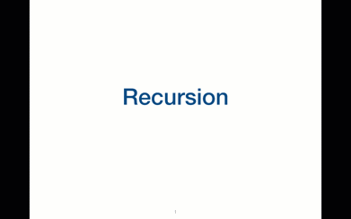
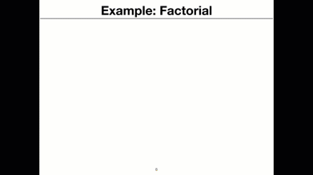

# Part 1
In the presentation software and language of your choice, script, and storyboard a video that teaches the following learning objectives related to recursion.  This work will be evaluated on organization and clarity rather than artistic merit.  The storyboard should consist of five to eight slides.     
## Recursion
     
For slides, see pdf in repo above. GIF included to show animations on last slide (which pdf cannot capture). GIF of just the last slide:     
     
# Part 2     
Devise a team-based learning activity appropriate for 10 groups of 4 to 5 students each, working remotely, to support the following learning objectives.  The activity should take no more than 60 minutes, including, setup, execution, and presentation or closing comments.  Please use no more than two pages to describe the activity.

* A student will be able to utilize an ORM to construct a model and utilize it to store data in  a relational database     

## Activity
* Intro (10 min) - Show how to setup a model in rails and add a presence validation. Introduce the activity.     
* Activity (35 min)     
     * Students download a skeleton rails project, set up the database, and run the preset migrations.     
     * Students create a model and add specified validations. In addition to presence validations, they will look at the docs to find out how to validate length, validate with a scope.    
     * Once their model is set, they will load the rails console and test their model/validations. In addition, they will seek to answer the following questions through experimentation:
          
          1. What is the difference between new, save, and create?
          2. What field gets added when an instance is saved to the database?     
          3. What is the difference between save! and save? Which one would you expect to use when creating an instance from user input? Why? When might you want to use the other command?     
          4. When do validations get run?     
          5. Why might we want model validations if we already have database level constraints?    

    * BONUS: have students try to validate presence of a boolean. What problem do they find with this approach? Provide hints as to more effective approaches.     

* Conclusion (15 min) - Come back together to discuss what the students discovered     

# Part 3     
Create a list of learning objectives covering one week of full-time learning in the computer science topic of your choice.     

## Topic: Web-based graphics     
After a week of learning, students should be able to:     
1. Create and animate a 2D scene using canvas     
2. Create basic 3D models using three.js buffer geometries and meshes     
3. Create and light a 3D scene using three.js      
4. Animate a 3D scene     
5. Track mouse movements/clicks in a three.js 3D scene using Raycaster
6. Map textures onto 2D and 3D shapes
7. Write basic vertex and fragment shaders in GLSL     
8. Integrate 2D and 3D graphics into interactive games 

